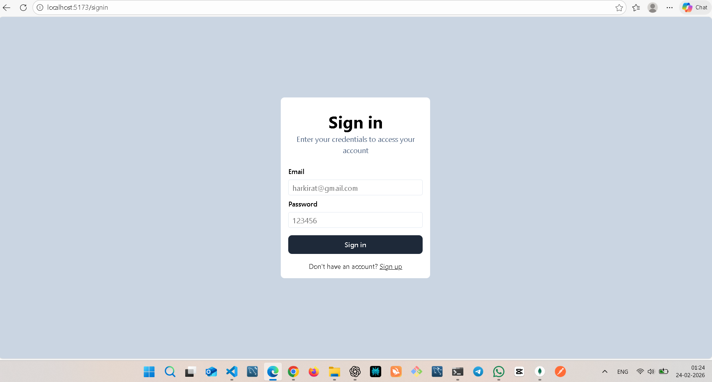
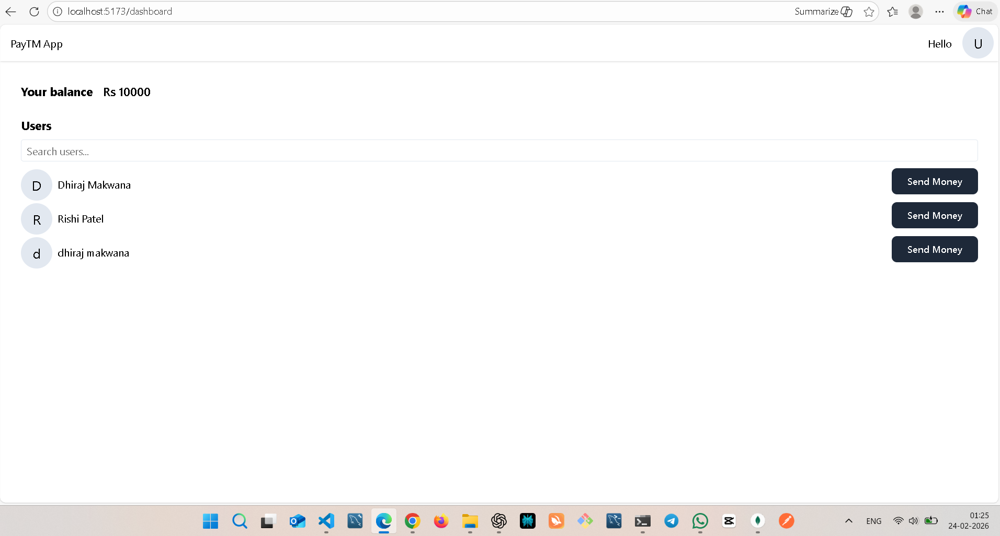
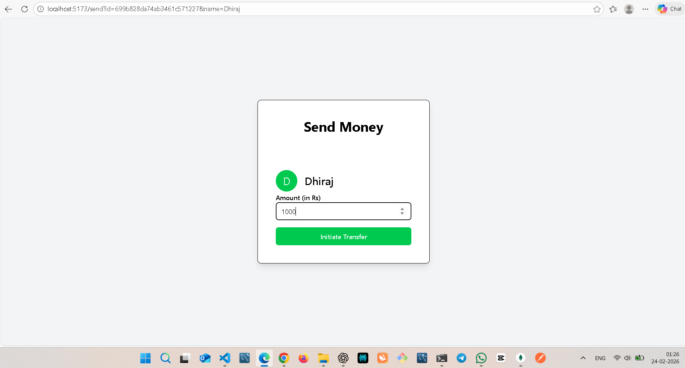

# 💸 PayTM Clone – MERN Stack Digital Wallet Application

A full-stack **MERN (MongoDB, Express, React, Node.js)** web application that allows users to securely register, log in, and transfer money to other users — similar to PayTM.

This project demonstrates real-world concepts like authentication, transactions, protected routes, and full-stack integration.

---

## 🚀 Live Features

✅ User Signup  
✅ Secure Signin  
✅ Dashboard with Dummy Account Balance  
✅ Search Users  
✅ Send Money to Other Users  
✅ Transaction Handling  
✅ JWT Authentication  
✅ Protected Routes  

---

## 🧠 Project Overview

This application simulates a **digital wallet system** where:

- Users can create an account
- Log in securely
- View their account balance
- Search for other users
- Transfer money instantly

The goal of this project is to demonstrate **end-to-end full stack development**, secure authentication, and clean UI/UX implementation.

---

## 🏗️ Tech Stack

### 🔹 Frontend
- React.js
- React Router
- Axios
- Tailwind CSS (or CSS modules if used)

### 🔹 Backend
- Node.js
- Express.js
- MongoDB
- Mongoose
- JWT (Authentication)

---

## 📂 Application Pages

### 1️⃣ Signup Page
- User registration
- Password hashing using bcrypt
- Account creation with initial balance

### 2️⃣ Signin Page
- JWT-based authentication
- Secure login system
- Token-based route protection

### 3️⃣ Dashboard
- Displays user balance
- Lists all users
- Search functionality
- Send Money button for each user

### 4️⃣ Send Money Page
- Enter transfer amount
- Transaction processing
- Balance update logic
- Safe backend validation

---

## 🔐 Authentication & Security

- JWT tokens are generated on login
- Protected routes using middleware
- Transactions validated server-side
- Prevents negative balance transfers

---

## 💰 Transaction Flow

1. User selects recipient
2. Enters amount
3. Backend validates:
   - Sender exists
   - Recipient exists
   - Sufficient balance
4. Atomic balance update
5. Transaction completes

---

## 📸 UI Preview

### 🔹 Signup Page

### 🔹 Signin Page

### 🔹 Dashboard

### 🔹 Send Money

